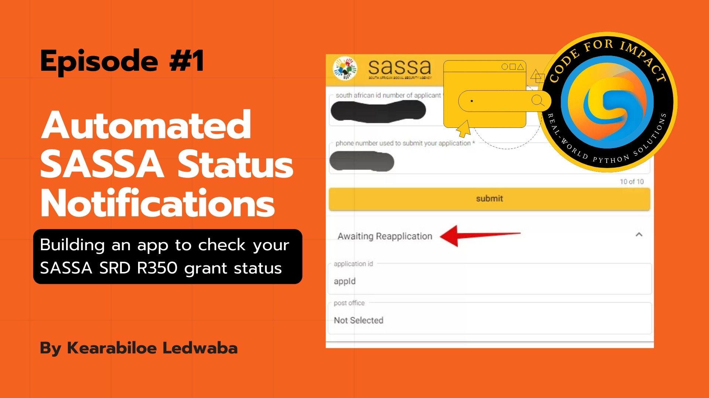

  **Episode/Project Title:** Building a SASSA SRD Status Notifier App

**Web Series Title:** Coding for Impact: Real-World Python Solutions

**Episode Number:** 1

**Date Published:** [Insert Date]

---

### Problem Statement:

* **Real-World Problem:** Many SASSA SRD grant beneficiaries face the challenge of repeatedly and manually checking their application status. This process is time-consuming, inconvenient, and can cause anxiety due to the uncertainty of the outcome.  Beneficiaries often have limited access to reliable internet or data, making frequent checks difficult.
* **Target Users:** SASSA SRD grant applicants and beneficiaries in South Africa, particularly those with limited internet access or those who need a more convenient way to stay updated on their application status.
* **Current Challenges/Limitations:** The official SASSA status check methods (website, USSD) require users to actively initiate the check each time.  There is no automated notification system to inform users of changes in their application status.  This leads to a cumbersome and inefficient process for beneficiaries.

---

### Proposed Solution:

* **High-Level Overview:** This episode details the development of a solution that automates the SASSA SRD status check process. The application will allow users to input their ID number and phone number, and then it will periodically check their status and send SMS notifications when there are updates.
* **Key Features:**
    * User registration with ID number and phone number.
    * Automated, periodic checking of SASSA SRD status.
    * SMS notifications for status updates.
    * USSD interface for users with limited internet access.
    * Basic error handling and input validation.
* **User Interaction:**
    * Users can register and receive updates via a USSD interface.

---

### Technology Stack:

* **Primary Language:** Python
* **Framework(s):** Django
* **Libraries:** requests,  AfricasTalking (or similar SMS library),  Possibly Celery (for background tasks)
* **Simulators/Tools (if applicable):** Python CLI,  AfricasTalking USSD simulator (if available)
* **Deployment Considerations (Conceptual):** Cloud hosting (e.g., AWS, Azure, Google Cloud),  local hosting (for development and testing).

---

### Episode Breakdown:

* **Part 1:** Building a SASSA SRD Status Notifier App
    * Focus: Designing and implementing a system to automate SASSA R350 grant status checks and notify users of updates via SMS.
    * Key Achievements:
        * Developed the backend logic for interacting with a (simulated) SASSA status service.
        * Implemented user input handling and validation.
        * Integrated SMS notification functionality.
        * Created a USSD interface for accessibility.

---

### Technical Deep Dive:

* **System Architecture:**
    * The application comprises the following components:
        * **USSD Interface:** Handles user interaction via USSD menus, allowing users to register and request status updates using their mobile phones.
        * **Backend Logic (Django):** The core of the application, responsible for:
            * Receiving user input from the USSD interface.
            * Validating user data.
            * Communicating with a (simulated) SASSA status service to retrieve the latest status.
            * Storing user data and status information in a database.
            * Scheduling and managing periodic status checks.
            * Sending SMS notifications via a third-party SMS gateway.
        * **Database (Conceptual):** Stores user ID numbers, phone numbers, application statuses, and timestamps.
        * **SMS Gateway (Simulated):** A third-party service (like Africa's Talking) is used to send SMS notifications to users.  In this episode, this might be simulated.

* **Data Model (if applicable):**
    * Conceptual data model (using Django models):
        * `User`:
            * `id_number` (CharField, unique, validated)
            * `phone_number` (CharField, unique, validated)
            * `created_at` (DateTimeField)
        * `StatusCheck`:
            * `user` (ForeignKey to User)
            * `status` (CharField)
            * `timestamp` (DateTimeField)
    * The `models.py` file in Django defines these models to structure the data and interact with the database.

* **Core Logic Implementation:**
    * Key functions and logic:
        * `handle_ussd_request()`:  Parses USSD requests, manages the USSD menu flow, and calls the appropriate functions.
        * `validate_user_input()`:  Validates the user's ID number and phone number formats.
        * `get_sassa_status()`:  Simulates fetching the user's SASSA SRD status.
        * `send_sms_notification()`:  Uses the Africa's Talking (or a similar) library to send an SMS to the user.
        * `periodic_status_check()`:   A function (potentially using Celery) that is scheduled to run periodically, fetching status updates for all registered users.
    * Code snippets would be included in the video to illustrate these functions.

* **External Integrations (Simulated/Conceptual):**
    * The application simulates integration with the SASSA status service.  The episode will explain how to make a request and handle a response.
    * The Africa's Talking API (or a similar service) is used to send SMS notifications. The episode will demonstrate how to use the API to send messages.

* **User Interface/Interaction Implementation:**
    * The USSD interface is implemented using the Africa's Talking API.  The episode will show how to define USSD menus, handle user input, and navigate between menus.
    * Code snippets will demonstrate how to structure the USSD menu logic.

* **Error Handling and Validation:**
    * The application validates user input (ID number and phone number) to ensure it is in the correct format.
    * Error handling is implemented to gracefully handle potential issues such as:
        * Invalid user input.
        * (Simulated) errors from the SASSA status service.
        * SMS sending failures.
    * Error messages are displayed to the user via the USSD interface.

* **Testing Approach:**
     * Manual testing of the USSD interface using the Africa's Talking simulator.
     * Basic unit tests for core functions (e.g., input validation).
     * Testing the SMS sending functionality (if a real SMS service is used).

---

### Skills Demonstrated:

* **Coding Skills (Python):** Django development,  USSD development (with Africa's Talking or similar),  API interaction (simulated),  data manipulation,  string processing,  error handling.
* **Leadership Skills:** Technical decision-making, architectural planning, and guiding the development process.
* **Abstraction Skills:** Translating the real-world problem of inefficient SASSA status checks into a technical solution that automates the process.
* **Problem-Solving:** Breaking down the problem of automating status checks into smaller, manageable tasks and developing a working solution.
* **System Design:** Designing the application architecture, including the USSD interface, backend logic, and external service integrations.

---

### Code Repository:

* **GitHub Link:** [Insert link to the GitHub repository containing the project code. All projects live under the Code4ImpactSA organization.] https://github.com/Code4Impact-SA/episode-1-sassa-notifier/
* **Template Repository:** https://github.com/Code4Impact-SA/episode-template/
* **Key Files/Directories:**
    * `sassa_notifier/`:  Django project directory.
    * `ussd/`:  Directory containing USSD-related code (views, logic).
    * `models.py`:  Django models defining the database schema.
    * `views.py`:  Django views handling USSD requests and responses.
    * `requirements.txt`:  List of Python dependencies.

---

### Future Improvements & Next Steps:

* Implement a more robust and scalable solution using Celery for background tasks.
* Deploy the application to a cloud platform (e.g., AWS, Azure, Google Cloud).
* Integrate with a real SASSA API (if available) or explore alternative data sources.
* Add a web interface for users with internet access.
* Implement more comprehensive error handling and logging.
* Enhance the user interface with more features.
* Add user authentication.

---

### Learning Resources & Further Exploration:

* Django documentation: [https://docs.djangoproject.com/en/4.2/](https://docs.djangoproject.com/en/4.2/)
* Africa's Talking API documentation: [https://developers.africastalking.com/](https://developers.africastalking.com/)
* Celery documentation: [https://docs.celeryq.dev/en/stable/](https://docs.celeryq.dev/en/stable/)
* SMS gateway providers:  Twilio,  Africa's Talking
* USSD protocol and development

---

### Connect:

* **Developer:** Kearabiloe Ledwaba
    * WhatsApp: [https://wa.me/27787025013](https://wa.me/27787025013)
    * LinkedIn: [https://linkedin.com/in/kearabiloe](https://linkedin.com/in/kearabiloe)
    * GitHub: [https://github.com/kearabiloe](https://github.com/kearabiloe)
    * Twitter/X: [https://x.com/keacoder](https://x.com/keacoder)
    * Email: [code4impactSA@gmail.com](mailto:code4impactSA@gmail.com)

* **YouTube:** [https://youtube.com/@Code4ImpactSA](https://youtube.com/@Code4ImpactSA)
* **Facebook:** [https://facebook.com/code4ImpactSA](https://facebook.com/code4ImpactSA)

---

### License:

* MIT

---

### Instructions for Use:

1.  **Running the Project Locally:**
    * Ensure you have Python 3.8+ and virtualenv installed.
    * Clone the repository and navigate to the project directory:
        ```bash
        git clone [your-repo-url]
        cd [project-directory]
        ```
    * Create and activate a virtual environment:
        ```bash
        python -m venv venv
        source venv/bin/activate  # On Windows use: venv\Scripts\activate
        ```
    * Install dependencies:
        ```bash
        pip install -r requirements.txt
        ```
    * Apply migrations and run the server:
        ```bash
        python manage.py migrate
        python manage.py runserver
        ```
    * Access the application at `http://127.0.0.1:8000`

2.  **Deployment Instructions:**
    * Choose a platform (e.g., Heroku, Render, Railway, or a cloud VM).
    * Set environment variables (e.g., `SECRET_KEY`, `DEBUG=False`, `ALLOWED_HOSTS`).
    * Configure database and static files according to the platform’s documentation.
    * Use `gunicorn` + `whitenoise` for production setups if necessary.

3.  **Reporting Issues:**
    * Open an issue on GitHub at [repository]/issues.
    * Include a clear title, detailed description, steps to reproduce, and any relevant logs or screenshots.

4.  **Documentation:**
    * Full documentation can be found at [Insert Docs URL] or inside the `/docs` directory if provided.

5.  **Contributing:**
    * Fork the repository, create a new branch, make your changes, and submit a pull request.
    * Follow the project's contribution guidelines and code style.
